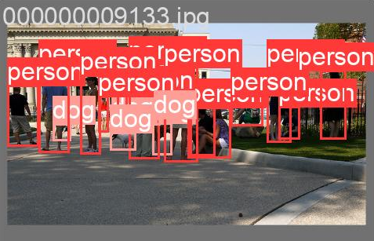
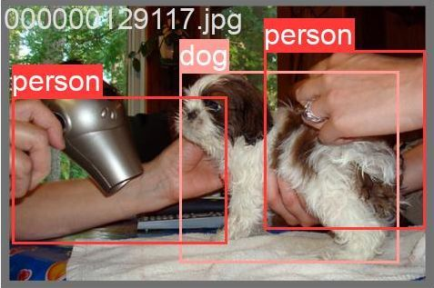
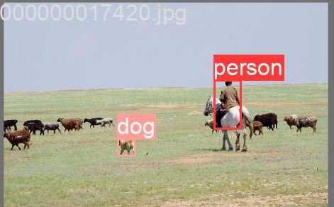
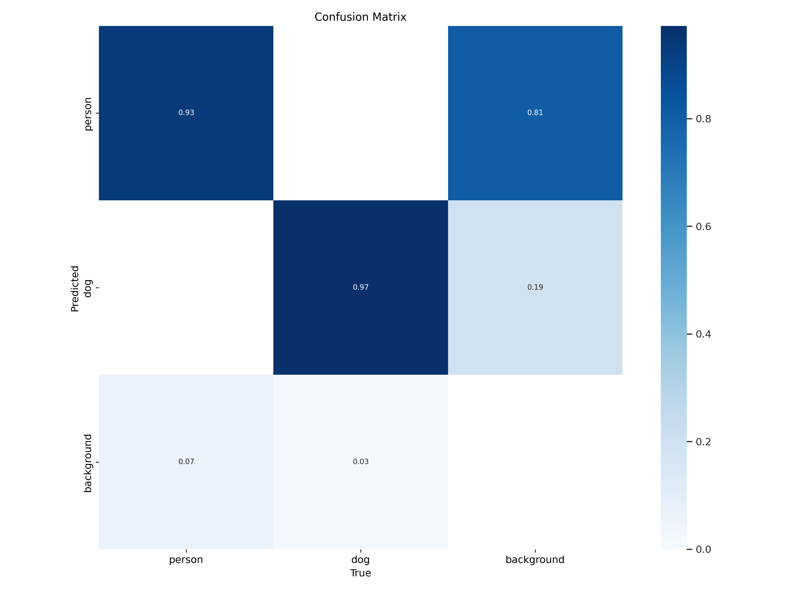

# [Projeto de Estudo] Detecção de Objetos na Prática com Yolo

Este exercício pretende explorar sistemas de visão computacional além da teoria. O objetivo não é apenas treinar um modelo, mas sim participar de cada etapa do processo: desde a criação automatizada de um dataset até a avaliação de um modelo treinado, entendendo como os sistemas de IA "enxergam" o mundo a nível de código.

Esta documentação é o mapa desse primeiro desafio, mirando em estudos futuros e na ampliação da minha formação como DevOps.

---

### O Desafio Proposto
O objetivo era treinar uma rede neural **YOLO (You Only Look Once)** para identificar e localizar objetos de duas classes específicas — `person` (pessoa) e `dog` (cachorro) — em imagens diversas.

### As Ferramentas Utilizadas
* **Dataset:** Subconjunto do [COCO Dataset](https://cocodataset.org/#home), um universo de imagens do cotidiano amplamente utilizada para esse tipo de teste.
* **Criação Automatizada do Dataset:** Um script Python customizado (`prepare_dataset.py`) utilizando a biblioteca [FiftyOne](https://voxel51.com/) para automatizar todo o processo de download, filtragem e formatação dos dados.
* **Notebook Base e Ambiente de Treinamento:** O fluxo de trabalho foi desenvolvido a partir de um notebook de referência para YOLOv5, disponível [neste link do Google Colab](https://colab.research.google.com/drive/1lTGZsfMaGUpBG4inDIQwIJVW476ibXk_#scrollTo=j0t221djS1Gk), que serviu como laboratório na nuvem com acesso a GPUs.
* **O Cérebro da Operação:** [YOLOv5](https://github.com/ultralytics/yolov5), uma implementação moderna e poderosa da arquitetura YOLO.

<**YOLO (You Only Look Once)** é um algoritmo de **detecção de objetos em tempo real** que identifica e localiza múltiplos alvos em uma imagem ou vídeo com uma única análise. Ao invés de utilizar escaneamentos múltiplos, o YOLO divide a imagem em uma grade e prevê caixas delimitadoras e classes para cada tipo de objeto, tornando-o extremamente rápido e eficiente para aplicações que exigem velocidade, como carros autônomos ou sistemas de vigilância.>

---

### Resultados do Experimento
Após 50 épocas de treinamento, o modelo não apenas aprendeu, mas se destacou, alcançando uma precisão (mAP@.5) de **96.7%**. Abaixo, uma amostra do que ele agora é capaz de "ver":

| Detecção em Cena Complexa | Detecção em Close-up | Detecção Múltipla |
| :---: | :---: | :---: |
|  |  |  |

*(Nota: A sobreposição dos rótulos em diversas imagens é apenas a maneira como é representado cada um dos alvos identificados e quão próximos estão entre si, mas as caixas delimitadoras demonstram a precisão do modelo.)*

A Matriz de Confusão abaixo confirma a alta acurácia, mostrando que o modelo raramente confunde as classes ou falha em detectar um objeto presente.



---

### Instruções de Execução

Para replicar este projeto do zero, siga os passos:

1.  **Clone o Repositório:**
    ```bash
    git clone [https://github.com/seu-usuario/seu-repositorio.git](https://github.com/seu-usuario/seu-repositorio.git)
    cd seu-repositorio
    ```
2.  **Gere o Dataset:**
    * Primeiro, instale a dependência para a preparação dos dados:
        ```bash
        pip install fiftyone
        ```
    * Execute o script de preparação para baixar, formatar e compactar o dataset. Este processo criará o arquivo `coco-yolo.zip` na pasta do projeto.
        ```bash
        python prepare_dataset.py
        ```
3.  **Faça o Upload para o Drive:**
    * Faça o upload do arquivo `coco-yolo.zip` recém-criado para a raiz do seu Google Drive.

4.  **Execute o Notebook de Treinamento:**
    * Abra o arquivo `Treinamento_com_Yolo.ipynb` no Google Colab.
    * Assegure-se de que o ambiente de execução está configurado para **GPU** (`Ambiente de execução` > `Alterar o tipo de ambiente de execução`).
    * Execute as células de código em ordem. O notebook irá conectar ao seu Drive, copiar o dataset e iniciar o treinamento.

---

### Além do Commit
Esse estudo não foi apenas rodar um scriipt e esperar pelo melhor. Foi um profundo aprendizado sobre a resiliência necessária para depurar, a importância da atenção aos detalhes e as realidades de se trabalhar com ferramentas complexas e pouco intuitivas.

### Próximos Passos: Da Detecção à Geração com LoRA
Com os objetivos propostos alcançados, o próximo desafio é dar um passo adiante: ensinar uma IA a **"imaginar" e criar**. O próximo passo é entender fundamentos da Inteligência Artificial Generativa, com o treinamento de um **LoRA** para ser usado com o Stable Diffusion. Isso exigirá um novo conjunto de habilidades, como a curadoria manual de um dataset e o uso de ferramentas como o Kohya's SS, representando a transição do campo da análise de imagens para o da criação.